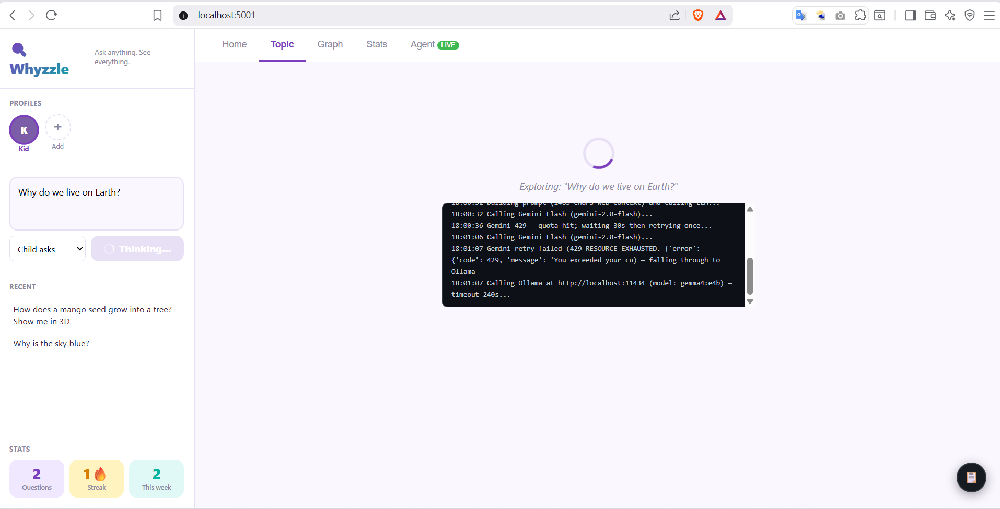

# 🔍 Whyzzle
### *Ask anything. See everything.*

> An AI-powered curiosity coach that turns every question into an instant visual explanation — and grows a personal knowledge map for every person who uses it.

---

## What is Whyzzle?

Whyzzle is a local MCP-powered app where you (or your child) ask any question — *"Why is the sky blue?", "How do planets orbit?", "What is 6 × 7?"* — and get back:

- **A clear explanation** tuned to the asker's age (a 6-year-old and a 38-year-old get very different answers)
- **A beautiful custom visual** — SVG diagram or interactive HTML canvas — generated fresh for that exact question
- **Three follow-up questions** to keep curiosity alive
- **A growing knowledge graph** that connects everything you've ever asked

Every profile has its own private curiosity map. Switch between family members and the entire view — graph, stats, recent history — switches too.

---

## Sample Screens

### 1 · Main Dashboard

```
┌─────────────────────────────┬──────────────────────────────────────────────────────┐
│  🔍 Whyzzle                 │                                                      │
│  Ask anything. See…         │  Why is the sky blue?                                │
├─────────────────────────────│                                                      │
│  PROFILES                   │  #light  #atmosphere  #physics  [spatial]  by child  │
│  ●Aarav  ○Dad  ○Priya  [+]  │  age 7                                               │
│                             │                                                      │
├─────────────────────────────│  When sunlight enters the atmosphere, it bumps into  │
│  What are you curious about?│  tiny air particles. Blue light bounces around much  │
│  ┌─────────────────────────┐│  more than other colours — like a pinball! That's    │
│  │ Why is the sky blue?    ││  why when you look up, all you see is blue light      │
│  │                         ││  bouncing toward your eyes.                           │
│  └─────────────────────────┘│                                                      │
│  [Child asks ▾]   [Ask ✨]  │  ┌──────────────────────────────────────────────┐   │
│                             │  │  ░░░░░░░░░ CUSTOM SVG VISUAL ░░░░░░░░░░░░░   │   │
├─────────────────────────────│  │                                              │   │
│  RECENT                     │  │   ☀️  →→ blue rays scatter everywhere →→     │   │
│  • Why is the sky blue?     │  │                  ↕  ↕  ↕                    │   │
│  • How do planets orbit?    │  │           🌍 atmosphere layer                │   │
│  • What is 6 × 7?           │  │                                              │   │
│  • Why do leaves fall?      │  └──────────────────────────────────────────────┘   │
│                             │                                                      │
├─────────────────────────────│  🤔 Curious about…                                   │
│  STATS                      │  [Why is the sunset red?] [What is UV light?]        │
│  ┌──────┬──────┬──────┐     │  [How do rainbows form?]                             │
│  │  14  │  3🔥 │   6  │     │                                                      │
│  │Quest.│Streak│/week │     │  🔗 Related in your map                              │
│  └──────┴──────┴──────┘     │  [How do planets orbit?]  [Why is grass green?]      │
└─────────────────────────────┴──────────────────────────────────────────────────────┘
```

---

### 2 · Knowledge Graph View

```
┌─────────────────────────────┬──────────────────────────────────────────────────────┐
│  🔍 Whyzzle                 │  Home  Topic  [ Graph ]  Stats                       │
│  ...                        ├──────────────────────────────────────────────────────┤
│                             │  ● child asked   ● parent asked   ● together         │
│  ●Aarav  ○Dad   [+]         ├──────────────────────────────────────────────────────┤
│                             │                                                      │
│  ┌─────────────────────────┐│          ┌─────────────────────────────────────┐    │
│  │ Ask a question…         ││          │                                     │    │
│  └─────────────────────────┘│          │     ○ Rainbows?                     │    │
│  [Child asks] [Ask ✨]       │          │    /                                │    │
│                             │          │   ●  Sky blue?──────●  Sunsets?     │    │
│  RECENT                     │          │   │                  \              │    │
│  • Why is the sky blue?     │          │   │                   ○  UV light?  │    │
│  • How do planets orbit?    │          │   │                                 │    │
│  • Why do leaves fall?      │          │   ●  Planets orbit?                 │    │
│  • What is 6 × 7?           │          │   │                                 │    │
│                             │          │   ●  Gravity?───────○  Black holes? │    │
│  STATS                      │          │                                     │    │
│  ┌──────┬──────┬──────┐     │          │        ○  6 × 7?                    │    │
│  │  14  │  3🔥 │   6  │     │          │        │                            │    │
│  │Quest.│Streak│/week │     │          │        ○  Multiplication tables?    │    │
│  └──────┴──────┴──────┘     │          └─────────────────────────────────────┘    │
│                             │          ● = larger node has more connections        │
└─────────────────────────────┴──────────────────────────────────────────────────────┘
```

> Click any node → jumps straight to that topic's explanation + visual.

---

### 3 · Stats View

```
┌─────────────────────────────┬──────────────────────────────────────────────────────┐
│  🔍 Whyzzle                 │  Home  Topic  Graph  [ Stats ]                       │
│  ...                        ├──────────────────────────────────────────────────────┤
│  ●Aarav  ○Dad   [+]         │                                                      │
│                             │  Aarav's Curiosity Stats                             │
│                             │                                                      │
│                             │  ┌──────────────┐ ┌──────────────┐ ┌─────────────┐ │
│                             │  │      14      │ │    3  🔥     │ │      6      │ │
│                             │  │ Total quest. │ │  Day streak  │ │  This week  │ │
│                             │  └──────────────┘ └──────────────┘ └─────────────┘ │
│                             │                                                      │
│                             │  TOP BRANCH                                          │
│                             │  🌿 space — 6 questions                              │
│                             │                                                      │
│                             │  TOPIC CLOUD                                         │
│                             │  #space(6)  #light(5)  #physics(4)                   │
│                             │  #biology(3)  #math(2)  #atmosphere(2)               │
│                             │  #earth(1)  #gravity(1)                              │
└─────────────────────────────┴──────────────────────────────────────────────────────┘
```

---

### 4 · Profile Strip & Add Profile Modal

```
  PROFILES
  ╔══════╗  ┌──────┐  ┌──────┐  ┌ ─ ─ ┐
  ║  A   ║  │  D   │  │  P   │    +
  ╚══════╝  └──────┘  └──────┘  └ ─ ─ ┘
   Aarav      Dad      Priya     Add
  (active)

  Clicking Aarav's chip      → his map, his stats, his graph
  Clicking Dad's chip        → Dad's map, stats, graph (completely separate)
  Hovering a chip shows  [×] → delete that profile + all its questions
  Clicking  [+]  opens  ─ ─ ─ ─ ─ ─ ─ ─ ─ ─ ─ ─ ─ ─ ─ ─ ─ ─ ─ ─ ─ ─ ─ ─ ┐
                        │             New Profile                            │
                        │  Name  ┌──────────────────────┐                  │
                        │        │  Priya               │                  │
                        │  Age   ┌──────────────────────┐                  │
                        │        │  10                  │                  │
                        │                          [Cancel] [Create]       │
                        └ ─ ─ ─ ─ ─ ─ ─ ─ ─ ─ ─ ─ ─ ─ ─ ─ ─ ─ ─ ─ ─ ─ ─ ─ ┘
```

---

### 5 · Age-Adaptive Explanations (same question, different profiles)

| Profile | Age | What Whyzzle says for *"Why is the sky blue?"* |
|---|---|---|
| **Tobi** | 5 | *"Air has tiny invisible helpers that grab blue light and throw it everywhere — so your eyes see blue!"* |
| **Aarav** | 8 | *"Sunlight is made of all colours mixed together. When it hits the air, the tiny particles scatter blue light much more than red or green light. That scattered blue fills the whole sky."* |
| **Priya** | 13 | *"Sunlight undergoes Rayleigh scattering in the atmosphere. Shorter wavelengths like blue (≈450 nm) scatter ~10× more than longer red wavelengths (≈700 nm)..."* |
| **Dad** | 38 | *"Rayleigh scattering causes the preferential scattering of shorter-wavelength visible light. The scattering intensity is inversely proportional to λ⁴, meaning blue light scatters ~9.4× more than red..."* |

---

## Features

| Feature | Detail |
|---|---|
| **Multi-profile** | Up to 8 colour-coded profiles, each with their own map |
| **Age-adaptive answers** | 5 depth tiers: 4–6 · 7–10 · 11–14 · 15–17 · 18+ |
| **Live web search** | DuckDuckGo instant API → HTML snippet fallback → Claude knowledge |
| **Custom visuals** | SVG or interactive HTML — generated fresh for every single question |
| **Curiosity map** | Personal knowledge graph; topics auto-connect by shared tags |
| **Cross-session memory** | Ask "why rainbows?" and Whyzzle says *"this links to your sky question"* |
| **Follow-up chips** | Clickable chips auto-ask the next question |
| **Knowledge graph** | vis-network force graph — click any node to read that topic |
| **Stats** | Streak tracker, top branch, weekly count, tag cloud |
| **MCP server** | Full Claude Desktop integration — all 4 tools available to the agent |

---

## Quick Start

### Prerequisites

- Python 3.10+
- An [Anthropic API key](https://console.anthropic.com/)

### 1 · Clone and install

```bash
git clone <repo-url>
cd whyzzle
pip install -r requirements.txt
```

### 2 · Set your API key

```bash
# Copy the example file
cp .env.example .env

# Edit .env and paste your key
ANTHROPIC_API_KEY=sk-ant-your-key-here
```

### 3 · Start the dashboard

```bash
python webapp.py
```

Open **http://localhost:5001** in your browser.

That's it. No database, no Docker, no build step.

---

## First-Time Flow

```
1.  Open http://localhost:5001
         ↓
2.  Click  [+ Create Profile]
    → Enter name + age  (e.g. "Aarav", 7)
         ↓
3.  Type a question in the sidebar ask-box
    → e.g. "Why do stars twinkle?"
         ↓
4.  Watch the explanation + visual appear in the main panel
         ↓
5.  Click a follow-up chip to go deeper
         ↓
6.  Click  Graph  tab to see your growing curiosity map
         ↓
7.  Add a second profile (e.g. "Dad", 38) and notice
    how the same question gives a completely different answer
```

> **Tip:** Press **Ctrl + Enter** (or **Cmd + Enter** on Mac) to submit a question without reaching for the mouse.

---

## Project Structure

```
whyzzle/
│
├── webapp.py               ← Flask web server  →  http://localhost:5001
├── server.py               ← MCP server        →  Claude Desktop integration
│
├── tools/
│   ├── profiles.py         ← Profile CRUD (profiles.json)
│   ├── curiosity_map.py    ← Map CRUD + auto-connect + stats (curiosity_map.json)
│   ├── search_and_explain.py  ← Web search + Claude explanation + visual
│   └── render_dashboard.py    ← Structured responses for MCP context
│
├── ui/
│   └── index.html          ← Full single-page app (no framework, no build step)
│
├── data/                   ← Auto-created on first run
│   ├── profiles.json
│   └── curiosity_map.json
│
├── .env.example            ← Copy to .env, add your API key
└── requirements.txt
```

---

## How the Intelligence Loop Works

```
You type a question
        │
        ▼
① manage_curiosity_map("get_related")
  → finds topics you already asked with overlapping tags
  → "this connects to your rainbows question from last week"
        │
        ▼
② search_and_explain(question, profile_id)
  → searches DuckDuckGo for accurate web context
  → reads profile age → picks the right explanation depth
  → Claude writes the explanation + generates SVG/HTML visual
  → produces 3 follow-up questions + concept tags
        │
        ▼
③ manage_curiosity_map("add_topic")
  → saves everything to curiosity_map.json under this profile
  → auto-connects to related topics by tag overlap (bidirectional)
        │
        ▼
④ Dashboard updates
  → main panel: explanation + visual + follow-up chips
  → sidebar: recent list + stats numbers
  → graph tab: new node with edges to connected topics
```

---

## Claude Desktop Integration (MCP)

Add this to your Claude Desktop config file:

**Mac:** `~/.config/claude/claude_desktop_config.json`  
**Windows:** `%APPDATA%\Claude\claude_desktop_config.json`

```json
{
  "mcpServers": {
    "whyzzle": {
      "command": "python",
      "args": ["/absolute/path/to/whyzzle/server.py"],
      "env": {
        "ANTHROPIC_API_KEY": "sk-ant-your-key-here"
      }
    }
  }
}
```

Once connected, Claude Desktop can call all four tools directly:

| Tool | What it does |
|---|---|
| `manage_profiles` | list · create · update · delete · set_active |
| `search_and_explain` | web search + age-calibrated explanation + custom visual |
| `manage_curiosity_map` | read · add_topic · get_related · get_stats · update_connections |
| `render_dashboard` | returns structured view data + link to the browser dashboard |

**Example agent prompt:**
```
I'm using Whyzzle. My profile ID is <id>.
Question: "How do black holes form?"
Please: search and explain it, save it to my map, then show my updated graph stats.
```

---

## Tech Stack

| Layer | Technology |
|---|---|
| MCP server | Python 3.10+, `mcp` SDK |
| Web server | Flask 3 |
| Web search | DuckDuckGo instant API · HTML fallback via `httpx` + `beautifulsoup4` |
| AI | Anthropic `claude-sonnet-4-6` — explanations + visual generation |
| Data | Plain JSON files — no database required |
| Frontend | Vanilla HTML / CSS / JavaScript — no framework, no build step |
| Graph | [vis-network](https://visjs.github.io/vis-network/) (CDN) |

---

## Explanation Depth Reference

| Profile age | Style |
|---|---|
| **4 – 6** | 1–2 sentences · one concrete analogy · zero jargon |
| **7 – 10** | 2–3 paragraphs · relatable comparisons · at most one new word |
| **11 – 14** | 2–3 paragraphs · proper terms with brief definitions · cause-and-effect |
| **15 – 17** | 3–4 paragraphs · near-adult depth · formal vocabulary |
| **18 +** | Full explanation · no simplification · domain vocabulary free |

---

## Data Storage

All data lives in two JSON files inside `data/`. Nothing leaves your machine.

**`data/profiles.json`**
```json
{
  "profiles": [
    { "id": "uuid", "name": "Aarav", "age": 7, "avatar_color": "#7B5EA7", "created_at": "2026-05-02" }
  ],
  "active_profile_id": "uuid"
}
```

**`data/curiosity_map.json`** — flat list of topics, each tagged with `profile_id`
```json
[
  {
    "id": "uuid",
    "profile_id": "uuid",
    "question": "Why is the sky blue?",
    "asked_by": "child",
    "date": "2026-05-02",
    "profile_age": 7,
    "explanation": "...",
    "visual_code": "<svg ...>...</svg>",
    "visual_type": "svg",
    "follow_ups": ["Why is the sunset red?", "What is UV light?", "How do rainbows form?"],
    "tags": ["light", "atmosphere", "physics"],
    "concept_type": "spatial",
    "connected_to": ["topic-id-1", "topic-id-2"],
    "depth": 2
  }
]
```

Profiles never see each other's topics — every map read/write filters strictly by `profile_id`.

---

## Visual Types

Claude decides the best visual for each question automatically:

| Question pattern | Visual Whyzzle generates |
|---|---|
| Physics / optics | SVG diagram with light rays, labels, annotations |
| Orbital / motion | SVG with CSS animation — objects in motion |
| Timeline / growth | SVG sequential strip: step 1 → step 2 → step 3 |
| Comparison | SVG side-by-side panel (e.g. Earth vs Mars) |
| Math concepts | SVG dot grid, number line, or animated proof |
| Calculus | Interactive HTML canvas — draggable point, live tangent |
| Biology / anatomy | SVG cross-section or labelled illustration |
| Photo-needed fallback | `related_search` string returned for manual lookup |

---

## Requirements

```
anthropic>=0.50.0
httpx>=0.27.0
beautifulsoup4>=4.12.0
flask>=3.0.0
mcp>=1.0.0
python-dotenv>=1.0.0
```

---

## Keyboard Shortcuts

| Shortcut | Action |
|---|---|
| `Ctrl + Enter` | Submit question (from ask box) |
| `Cmd + Enter` | Submit question (Mac) |

---

*Built by Raghu · EAG v4 · 2026-05-02*


